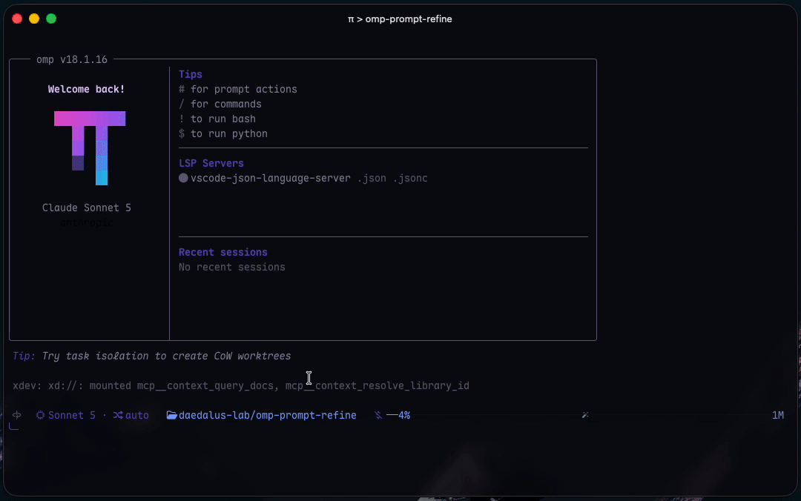

# omp-prompt-refine

You have a rough prompt. `/refine` rewords it so the agent you're about to send it to is more likely to do what you meant.

The result goes back in the editor. You still hit send.

A one-liner stays a one-liner. A vague or overloaded ask gets clearer intent with limited context, fewer holes, and language an agent can actually follow.



## Install

OMP `v18.*`+

```text
/marketplace add Shadorain/omp-prompt-refine
/marketplace install prompt-refine@omp-prompt-refine
```

Or clone:

```bash
git clone https://github.com/Shadorain/omp-prompt-refine.git ~/.omp/agent/extensions/prompt-refine
```

Restart OMP. `/refine` shows up in autocomplete. No extra config is needed, it uses the model you already have selected.

## Use

Leave the draft in the editor and press `Alt+Shift+R`. Or put the command on the first line:

```text
/refine --deep
rewrite the onboarding email so it does not promise a feature we have not shipped
```

Apply puts the rewrite in the composer. You still send it.

Don't submit `/refine` as the only line. That clears the editor. Shortcut or two-line form. `Alt+R` is retry, so this is `Alt+Shift+R`.

```text
/refine                 editor draft
/refine --light ...     keep it short
/refine --deep ...      find ways an agent could miss
/refine --model @slow   this run only
/refine --no-context    skip chat and project files
/refine --last          previous user message
/refine --undo          restore pre-Apply draft
/refine --setup         default models and extra files
```

## Optional models

`--model` wins. Otherwise `@prompt_refiner` / `prompt_refiner`. Otherwise the model saved by `/refine --setup`. Otherwise the current session model.

Deep mode's critic: `@prompt_critic` / `prompt_critic`, else the setup critic, else the same model as the rewrite.

```yaml
# ~/.omp/agent/config.yml
modelRoles:
  prompt_refiner: "@slow"
  prompt_critic: "@advisor"
```

Or run `/refine --setup` and pick from the same model list OMP uses. That writes `~/.omp/agent/prompt-refine.json`.

`--model` takes the same strings OMP does.

## What it won't do

Change what you asked for. Invent extra work. Send the prompt. Touch your repo.

The rewrite runs in a child session with no tools, shell, MCP, or file writes. Failures and Cancel put the original draft back.

It can peek at a little context so the wording fits the conversation: last few chat turns (no tool dumps), cwd, git branch, and the start of `AGENTS.md` / `CLAUDE.md` / `CONTEXT.md` plus any extra files from `/refine --setup`. `--no-context` turns that off.
